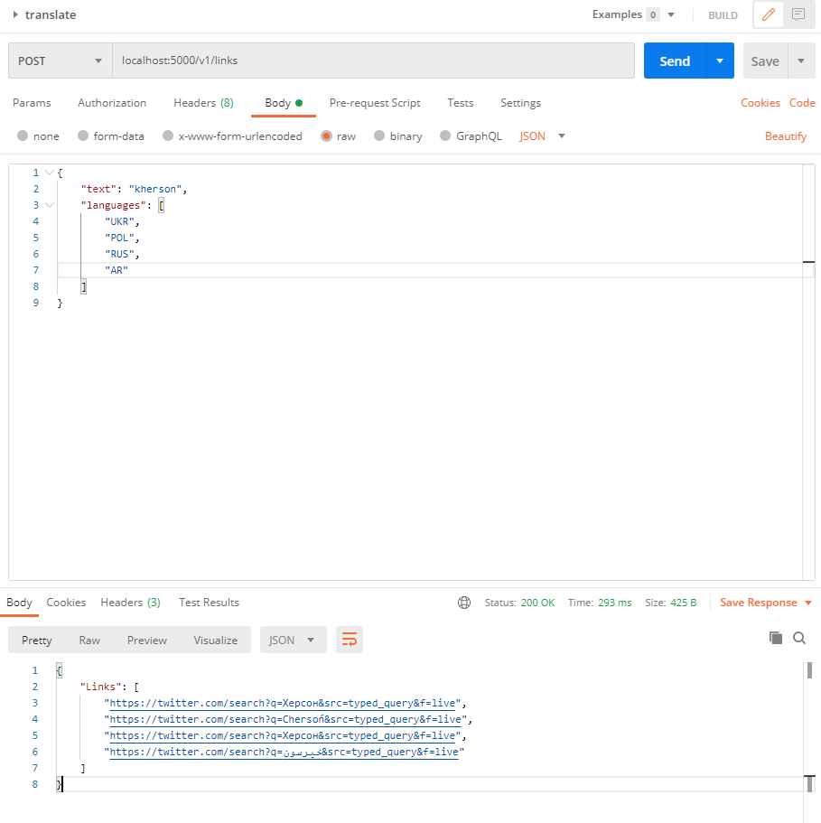

# Demonstration

This doc is to show what I can show in terms of where the tool is at.

Currently, we have a single backend endpoint, `/links` that takes a request containing:
```
{
    "text": "text to be translated",
    "languages": [
        "array",
        "of",
        "different",
        "languages"
    ]
}
```
which returns pregenerated twitter search links, i.e. `https://twitter.com/search?q=Chersoń&src=typed_query&f=live`.



These links are sufficient to launch twitter, presuming users are logged in, to search for the latest tweets with that text.